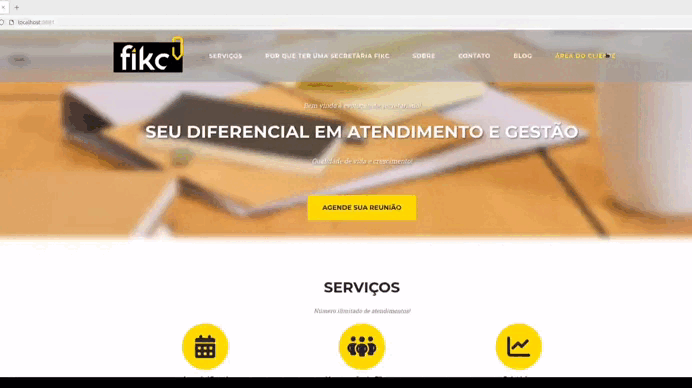

# FIKC

Secretária virtual com agendamento de reuniões, áreas de login separadas para administrador e cliente, e módulo de relatórios.

<p align="center">
  
</p>

## Sobre o projeto

O FIKC é uma aplicação web que funciona como uma secretária virtual, permitindo o agendamento de reuniões de forma organizada. O sistema conta com dois perfis de acesso — **administrador** e **cliente** — cada um com permissões e visões próprias, além de um espaço dedicado à geração e consulta de relatórios.

## Funcionalidades

- Agendamento de reuniões
- Autenticação e login separados por perfil (administrador / cliente)
- Área administrativa de gestão
- Geração e visualização de relatórios

## Tecnologias utilizadas

| Camada | Tecnologia |
|---|---|
| Backend | Node.js |
| Linguagem | JavaScript |
| Banco de dados | PostgreSQL |

## Estrutura do projeto

```
FIKC/
├── config/          # configurações da aplicação
├── helpers/         # funções utilitárias reutilizadas pela aplicação
├── migrations/      # scripts de criação/alteração das tabelas do PostgreSQL
├── models/          # modelos/consultas de acesso ao banco de dados
├── public/          # arquivos estáticos
├── routes/          # definição das rotas e endpoints da aplicação
├── uploads/         # arquivos enviados pelos usuários
├── views/           # templates das páginas renderizadas
└── app.js           # ponto de entrada da aplicação
```
